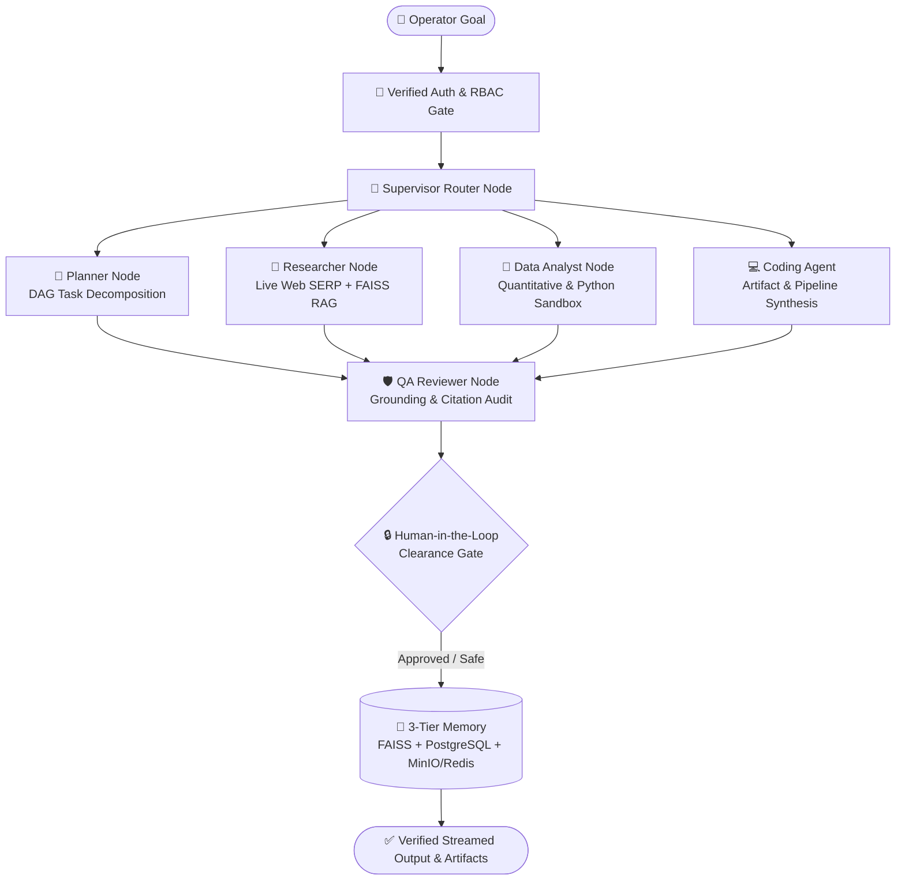

<div align="center">

# ✦ AZOL AI (V1.0)
### Autonomous Multi-Agent AI Operating System

**Turn complex goals into coordinated AI workflows — from planning and research to execution, verification, and persistent memory.**

[](#)
[](#)
[](#)
[](#)
[](#)

</div>

---

## 💡 Overview

**AZOL AI** is a production-grade, multi-tenant **Autonomous AI Operating System** engineered to move beyond isolated, single-turn chat interfaces. 

When given a high-level goal in plain language, AZOL AI decomposes the objective, routes subtasks across specialized **LangGraph** agents, grounds responses in private **FAISS** vector memory and live web search, executes Python analysis in a sandbox, audits every claim via a **QA Reviewer** node, and persists execution checkpoints in **PostgreSQL**.

> **Give AI a goal. AZOL AI coordinates the work.**  
> `PLAN` → `RESEARCH` → `ANALYZE` → `EXECUTE` → `VERIFY`

---

## ⚡ Built Differently

| Dimension | Traditional AI Chatbot | AZOL AI Operating System (V1.0) |
| :--- | :--- | :--- |
| **Execution Scope** | One prompt → one isolated answer | One goal → multi-step autonomous DAG execution |
| **Tool & Agent Routing** | Human manually switches between tools | **Supervisor Node** dynamically routes to specialist agents |
| **Knowledge & Memory** | Forgets project context between sessions | **3-Tier Persistent Memory** (`FAISS` + `PostgreSQL` checkpoints) |
| **Trust & Citations** | Unverified output; human must fact-check | **QA Reviewer Node** + inspectable `ToolMessage` source audit |
| **High-Risk Governance** | Immediate execution without guardrails | **Human-in-the-Loop Gatekeeper** (`LangGraph interrupt()`) |
| **Multi-Tenancy** | Flat chat history | Strictly isolated **Project Workspaces** scoped by `user_id` |

---

## 📐 System Architecture & Agent Topology



---

## 🧩 Version 1.0 Core Capabilities (Live Today)

1. **🌐 Interactive 3D Meridian Landing Experience (`LandingPage.jsx`):**
   * Real-time 60fps 3D geodesic **AZOL Core** with 6 interactive orbital agent nodes, live workflow execution console, and V2.0 BI dashboard simulator.
2. **📊 Executive Control Plane (`Dashboard.jsx`):**
   * Live PostgreSQL & FAISS KPIs, individual `/api/v1/health` round-trip latency diagnostics, quick project workspace initializer, and `Ctrl+K` Global Command Palette.
3. **🧠 AI Workspace (`ChatInterface.jsx` & `GraphVisualizer.jsx`):**
   * Resizable 3-pane studio with real-time Server-Sent Events (SSE) token streaming, live **React Flow** DAG state visualization, clickable node I/O telemetry, task cancellation (`Stop`), `Re-run`, and downloadable code/report artifacts.
4. **🗂️ Isolated Project Workspaces (`Projects.jsx` & `ProjectWorkspace.jsx`):**
   * Dedicated 7-tab environments (`Overview`, `Chat`, `Documents`, `Tasks`, `Agents`, `Memory`, `Outputs`) with strict PostgreSQL thread isolation and project-scoped RAG retrieval.
5. **📚 5-Stage FAISS RAG Knowledge Base (`Documents.jsx` & `vector_store.py`):**
   * Multi-format document ingestion (`.pdf`, `.docx`, `.pptx`, `.csv`, `.txt`) with automated text extraction, chunking, local `BAAI/bge-small-en-v1.5` vector embedding, and in-app chunk preview.
6. **🤖 Agent Center (`AgentCenter.jsx`):**
   * Live configuration and dry-run sandbox for system directives, temperature, and tool bindings across all 8 LangGraph workforce nodes.
7. **📈 System Telemetry (`Analytics.jsx`):**
   * Live PostgreSQL execution metrics, token consumption charts, latency distribution, and 1-click CSV audit export.
8. **🛡️ Defense-in-Depth Authentication & Zero-Leak Vault (`AuthModal.jsx`, `Settings.jsx`, `auth.py`):**
   * Google OAuth 2.0 + Email/Password registration with DNS domain validation and live **SMTP 6-digit single-use OTP verification**.
   * `HttpOnly` session cookies, PostgreSQL JWT revocation blacklist (`POST /api/v1/auth/logout`), dual IP/email rate limiting, 5-attempt OTP destruction guard, and a write-only encrypted API secret vault.

---

## 📂 Repository Structure

```text
enterprise-ai-os/
├── backend/
│   ├── app/
│   │   ├── agents/          # LangGraph StateGraph (graph.py, nodes.py, state.py, tasks.py, tools.py)
│   │   ├── api/             # FastAPI Routers (auth, orchestrator, projects, documents, agents, analytics, settings, health)
│   │   ├── core/            # Config, Async PostgreSQL DB, Security, LLM Clients, Celery, Telemetry, Vector Store
│   │   ├── models/          # SQLAlchemy 2.0 Models (User, Project, Document, Chat, Agent, Analytics, UserSetting)
│   │   ├── schemas/         # Pydantic v2 Request/Response Schemas
│   │   └── services/        # Agent Graph Runner, Sandbox Executor, Storage & FAISS Services
│   ├── main.py              # FastAPI Application Entrypoint & CORS/Middleware Setup
│   ├── requirements.txt     # Python Dependencies
│   └── .env.example         # Sanitized Environment Template
├── frontend/
│   ├── src/
│   │   ├── components/      # LandingPage, AuthModal, Dashboard, ChatInterface, GraphVisualizer,
│   │   │                    # Projects, ProjectWorkspace, Documents, AgentCenter, Analytics, Settings, Sidebar
│   │   ├── App.jsx          # Main Enterprise OS Shell & Module Router
│   │   └── main.jsx         # React 18 Root & Google OAuth Provider
│   ├── package.json         # Frontend Dependencies (React 18, Framer Motion, Tailwind CSS, Lucide, Axios)
│   └── vite.config.js       # Vite Bundler & API Proxy Configuration
├── docker-compose.yml       # Containerized Infrastructure (PostgreSQL, Redis, MinIO)
├── Makefile                 # Developer Automation Commands
└── README.md                # Project Documentation
```

---

## 🛠️ Technology Stack

* **Frontend:** React 18, Vite, Tailwind CSS, Framer Motion, HTML5 3D Canvas, React Flow, Axios, Lucide Icons
* **Backend:** Python 3.11+, FastAPI, AsyncIO, Server-Sent Events (SSE), SQLAlchemy 2.0 (`asyncpg`), Pydantic v2
* **Agent Orchestration & LLMs:** LangGraph (`StateGraph`, `Command`, `interrupt`), LangChain Core, Groq LPU (`Llama 3.3 70B` / `Llama 3.1 8B`), OpenRouter, Gemini, OpenAI
* **RAG & Vector Memory:** FAISS (`faiss-cpu`), HuggingFace `BAAI/bge-small-en-v1.5`, PyPDF, `python-docx`, `python-pptx`
* **Infrastructure & Security:** PostgreSQL, Redis, MinIO, Docker Compose, Google OAuth 2.0, JWT (`HttpOnly` Cookies), SMTP Transactional OTP

---

## 🚀 Quick Start & Local Installation

### 1. Start Infrastructure Containers (PostgreSQL, Redis, MinIO)
```bash
docker-compose up -d
```

### 2. Configure & Launch FastAPI Backend
```bash
cd backend
python -m venv venv
# Windows PowerShell:
.\venv\Scripts\activate
# macOS / Linux:
# source venv/bin/activate

pip install -r requirements.txt
cp .env.example .env
# Add your API keys and SMTP credentials inside backend/.env

uvicorn main:app --reload --port 8000
```

### 3. Launch React Frontend
```bash
cd ../frontend
npm install
npm run dev
```
Open **`http://localhost:5173`** in your browser to explore the **AZOL AI 3D Landing Page** and sign in to the **Enterprise AI OS**.

---

## 🔭 Roadmap: AZOL AI V2.0 (`Planned`)

### **From AI Workforce → Autonomous Data Intelligence**
While V1.0 establishes multi-agent orchestration and document RAG, **AZOL AI V2.0 (`Planned`)** expands the platform into an autonomous **Data Analyst & Live BI Dashboard Engine**:
* **Universal Database Connectors (`Planned`):** Direct read-only connectors for PostgreSQL, MySQL, MongoDB, Snowflake, and CSV/Excel datasets.
* **Autonomous NL-to-SQL & Cleaning (`Planned`):** Automated schema introspection, query generation, statistical variance analysis, and anomaly detection.
* **Live BI Dashboard Synthesis (`Planned`):** Automatic generation of interactive, PowerBI/Tableau-grade visual dashboards directly from natural-language questions.

---

## 👨‍💻 Author & Architect

**Idealized, Architected, Designed & Built by MD Adil Muzaffar**  
*Founder • Applied AI/ML & Agentic Systems Engineer*

* 🌐 **Portfolio:** [md-adil-muzaffar-portfolia.lovable.app](https://md-adil-muzaffar-portfolia.lovable.app)
* 💻 **GitHub:** [@mdadilmuzaffar24](https://github.com/mdadilmuzaffar24)
* 🔗 **LinkedIn:** [MD Adil Muzaffar](https://www.linkedin.com/in/md-adil-muzaffar)